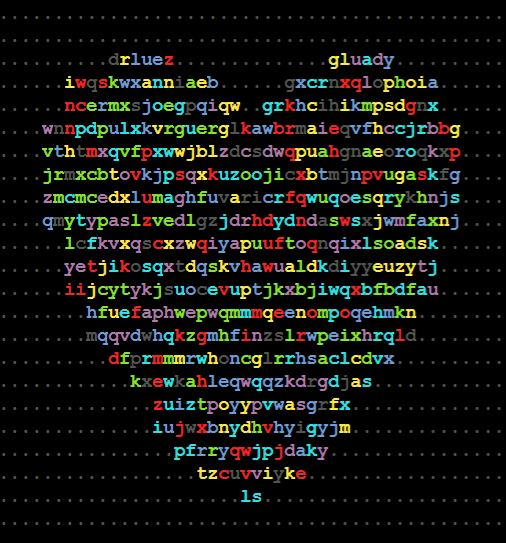

# colored_hearts
# Heart Animation in C

## Overview
This repository features a C program that demonstrates advanced console graphics by drawing animated hearts. Each heart is composed of colorful letters.

## Objectives
The primary goal of this project is to enhance my proficiency in C programming by exploring console graphics and animation. Through this project, I aim to understand the intricacies of character-based graphics and color manipulation in the console.

## Features
Animated Hearts: Gradually draws heart shapes in the console, creating a smooth animation effect.
